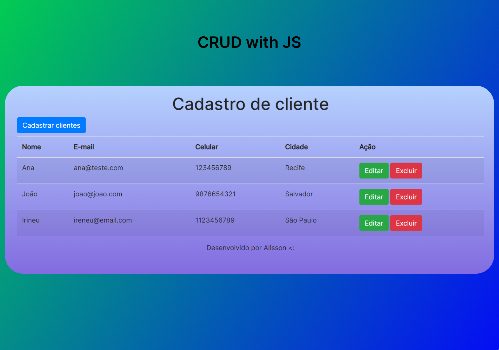

<h1 align="center"> CRUD with JS </h1>

  <a href="#-tecnologias">Tecnologias</a>&nbsp;&nbsp;&nbsp;|&nbsp;&nbsp;&nbsp;
  <a href="#-projeto">Projeto</a>&nbsp;&nbsp;&nbsp;|&nbsp;&nbsp;&nbsp;
  <a href="#memo-licença">Licença</a>

  

  

 

## 🚀 Tecnologias

Esse projeto foi desenvolvido com as seguintes tecnologias:

- HTML e CSS;
- Bootstrap;
- JavaScript;
- Git e Github;

## 💻 Projeto

Este projeto foi desenvolvido, com o objetivo de treinar algorítmo e lógica de progamação com Javascript. Nele é possível cadastrar um novo cliente, editar seus dados e os apagar.

Sobre o CRUD:

A sigla CRUD é um acrônimo, de quatro operações básicas, são elas:

C: Create – Criar um novo registro.

R: Read – Ler um registro, ou uma lista de registros.

U: Update – Atualizar um registro.

D: Delete – Excluir um registro.

## 🐳 Executando com docker (Produção)

### Construir a imagem e iniciar container
``docker build -f Dockerfile.build -t simple-crud-js . && docker run -d -p 8080:80 simple-crud-js``

### Acessar no navegador
``localhost``

## 🐳 Executando com docker (Ambiente de Desenvolvimento)
``docker compose up -d``

### Acessar no navegador
``localhost:8080``

## :memo: Licença

Esse projeto está sob a licença MIT.

---

Feito com ♥ by Alisson
